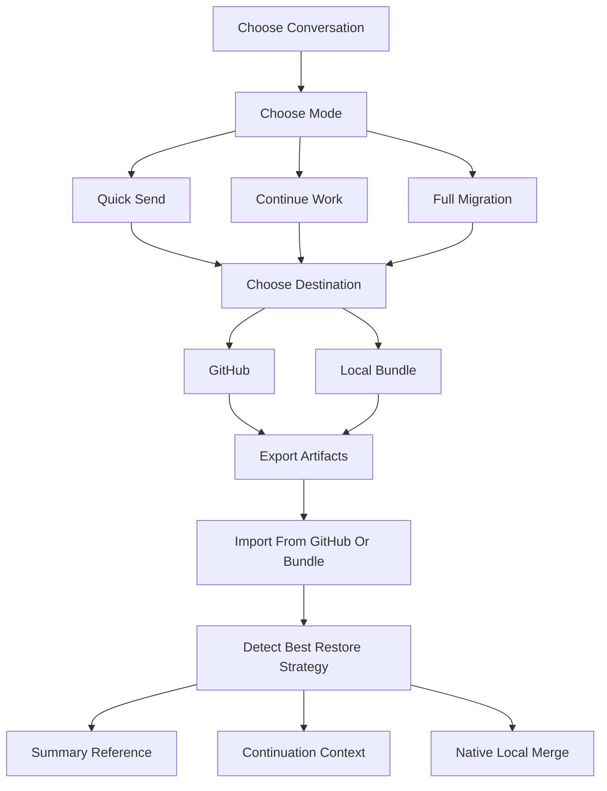

# codex-session-sync

Sync Codex local session history across devices with GitHub or local export bundles.

## Logic



## Plain-Language Overview

This skill is designed to feel closer to code sync than manual export/import.

- Pick the conversation you want to carry.
- Pick how much fidelity you need.
- Pick whether it should go to GitHub or a local bundle.
- Restore it on another machine with the safest merge strategy available.

In most cases, `继续工作（推荐）` is the best default because it preserves enough context for high-quality continuation without forcing a raw local-session merge.

## What It Does

- Lets users choose a conversation by title and recency
- Offers three product-style export modes:
  - `快速发送`
  - `继续工作（推荐）`
  - `完整迁移`
- Supports two export destinations:
  - GitHub
  - Local zip bundle
- Supports two import sources:
  - GitHub
  - Local zip bundle
- Preserves first-user-message titles even in lightweight exports
- Attempts low-risk local merge matching on import

## Skill Contents

- `SKILL.md`
- `scripts/`
- `references/`

## Installation

Copy the folder into your Codex skills directory:

```bash
cp -R codex-session-sync ~/.codex/skills/
```

Or symlink it during development:

```bash
ln -s /absolute/path/to/codex-session-sync ~/.codex/skills/codex-session-sync
```

## Recommended Usage

Use `继续工作（推荐）` for most cross-device workflows.

Use `完整迁移` only when you want the closest thing to native local-session restoration and are comfortable with the higher privacy exposure of raw session files.

## Publishing Notes

- Prefer a private sync repository when storing real user session content.
- Review the exported summaries before sharing publicly.
- Raw exports may include more metadata than users expect.
- Do not publish real exported session examples from private workspaces.
- Keep the skill repo separate from the user's real sync repo.

## Validation

```bash
python3 ~/.codex/skills/.system/skill-creator/scripts/quick_validate.py codex-session-sync
```
